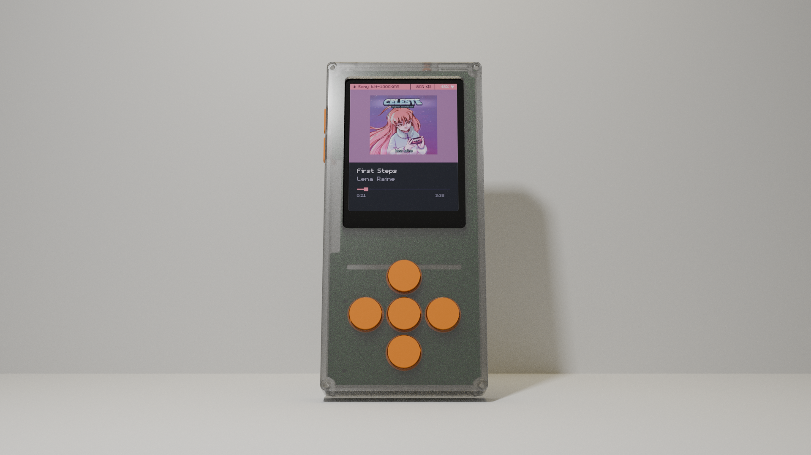
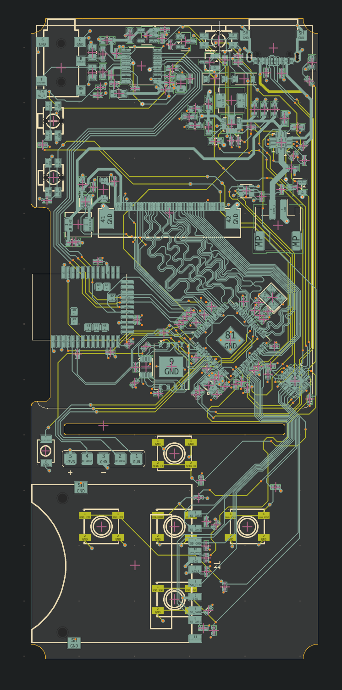
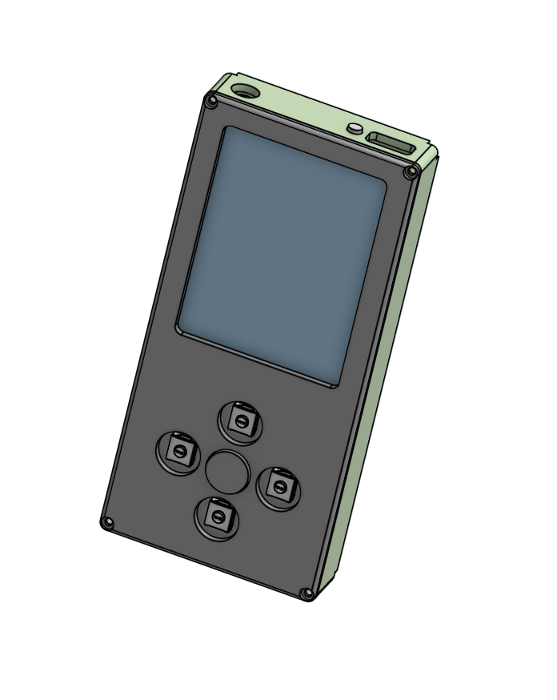
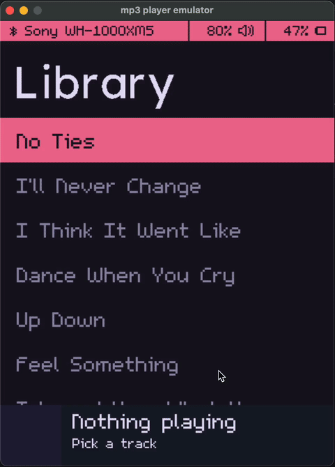
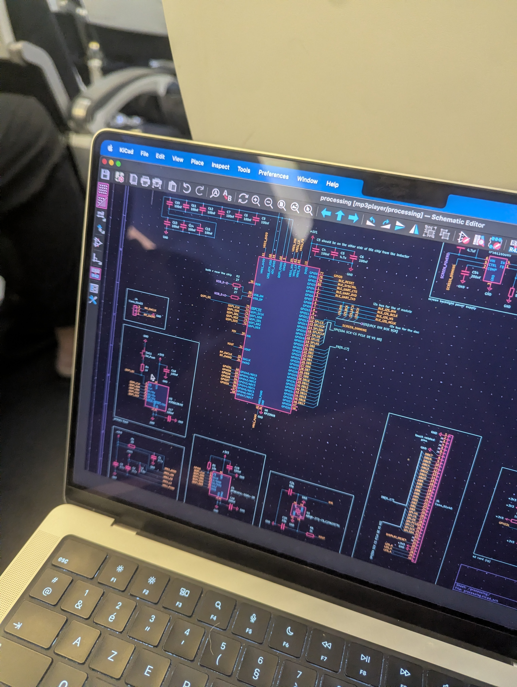
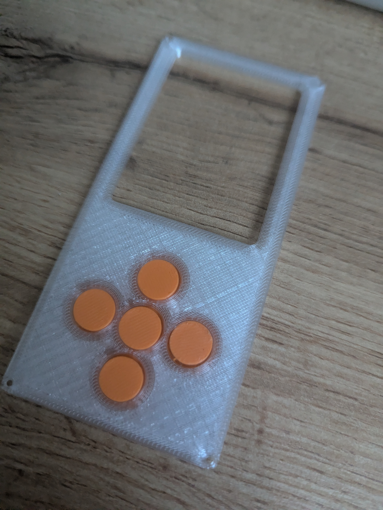
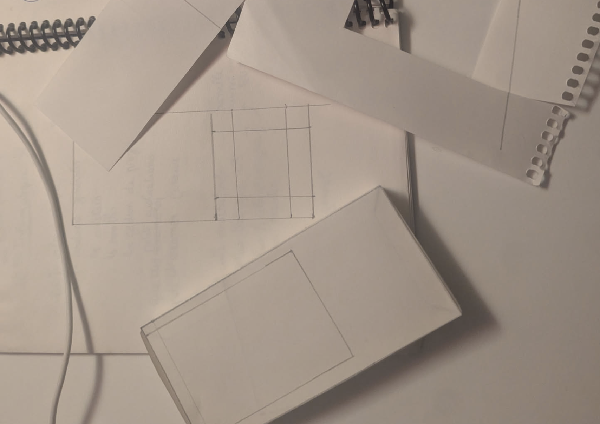
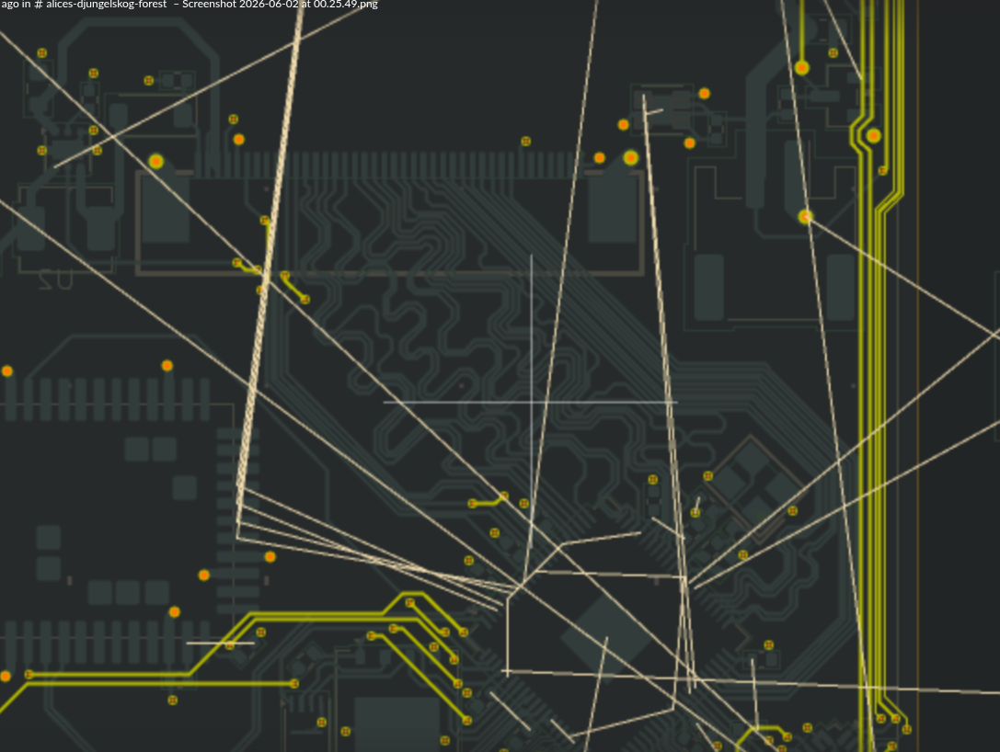
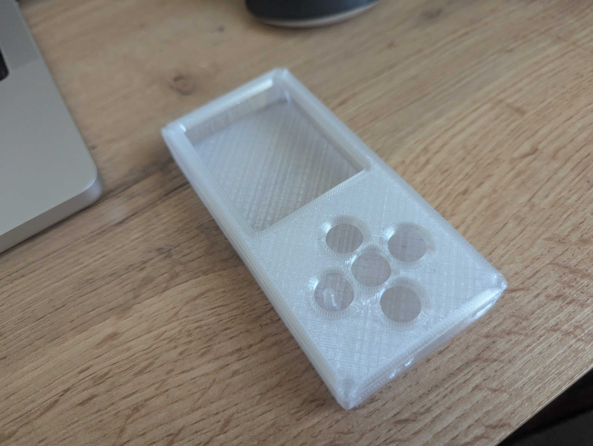

[{BOM}](https://github.com/espcaa/mp3-player/blob/main/BOM.md) - [{JOURNAL}](https://github.com/espcaa/mp3-player/blob/main/JOURNAL.md) - [{PCB}](https://kicanvas.org/?repo=https%3A%2F%2Fgithub.com%2Fespcaa%2Fmp3-player%2Ftree%2Fmain%2Fsrc%2Fkicad) - [{FIRMWARE}](https://github.com/espcaa/mp3-player/blob/main/src/firmware) - [{CAD}](https://cad.onshape.com/documents/df238a6328d0735d97863cef/w/6197d36ae28a3603accb47f3/e/8dee80f336b142ce4e5ee150?renderMode=0&uiState=6a380bcfd7346ceef4261340)

# mp3-player

A minimalist open source pocket sized¹ mp3 player\
\
(¹ if your pocket is big enough to fit a 115mmx50mmx20mm brick)

## Why did I even build this?

I bring my phone every time, everywhere I go. My main excuse is that I need it for music, but that's not usually what ends up happening... So I built this to have a dedicated music player that I could bring with me when I don't need a phone! (mainly high school or going for a walk)\
I also wanted to learn how to design a more complex & integrated pcb!\
\
If you find this cool, you should read [the journal](https://github.com/espcaa/mp3-player/blob/main/JOURNAL.md) I kept while designing this!

## Overview

**Specs**:

- mcu: rp2350b
- bluetooth module: fsc-BT1114QI
- dac: PCM5102A
- power: 505050 battery + BQ24075 power path ic
- pcb: 4 layer (signal, ground, power, signal) 115mmx50mm
- case: 3d printed

**Features**:

- full size sdcard slot
- 2.8 inch high definition color display (480x640, around 286 dpi)
- custom themes
- 3.5mm headphone jack
- bluetooth le + classic support
- modern and clean ui

## Hardware

_pcb & cad screenshots_
\
\
The brain is a 4 layer hand routed pcb, designed to be compact & cheap to manufacture (jlcpcb 4 layers basic tolerances).\
I first planned to use a nrf chip for the audio but finally moved to a feasycom module to support classic A2DP bluetooth audio (basically everything that is not recent/high end) because I realized my headphones were not le compatible (but now my new ones are!).\
Full size sdcard support is because I wanted to be able to use my mac's sdcard reader to easily transfer new music + not lose super small micro sd cards.\
I also originally wanted to make the case in transparent resin, but I ended up choosing 3d printing for multiple reasons:

- way cheaper
- faster to iterate on
- petg is way more shock resistant than resin
- faster to get a finished project

[explore the board & schematics in your browser](https://kicanvas.org/?repo=https%3A%2F%2Fgithub.com%2Fespcaa%2Fmp3-player%2Ftree%2Fmain%2Fsrc%2Fkicad)

## Firmware

_warning: this is wip and some parts of he firmware have been ai generated get a poc quickly, but I plan to rewrite it very soon._ \
\
The firmware is written in c and uses the pico sdk. I also wrote a desktop simulator that allows you to test ui changes without reflashing all the time/having the device.

**Building to run on device:**

(You need cmake, a pico sdk, an arm-none-eabi toolchain, pico-extras and sdl2 (only if you build the simulator) installed)

- clone this repo
- export these env vars:
  - `PICO_SDK_PATH` -> path to pico-sdk
  - `PICO_TOOLCHAIN_PATH` -> path to an arm-none-eabi toolchain (`Applications/ArmGNUToolchain/15.2.rel1/arm-none-eabi/bin` on my laptop)
  - `PICO_EXTRAS_PATH` -> path to pico-extras
- go to src/firmware/ & run `./build_pico.sh --clean`
- flash the uf2 via usb (hold BOOTSEL while plugging in the device, then drag the uf2 to the mounted drive)

**Building to run on desktop:**

_(this allows you to run/test the same ui on your computer without flashing the device!)_

- go to src/firmware/ & run `./run_emulator.sh --clean`

## License

Firmware is MIT, hardware is CERN-OHL-S, and the 3d files + docs are CC-BY-SA.\
See [LICENSE](LICENSE) for details.\
\
\

